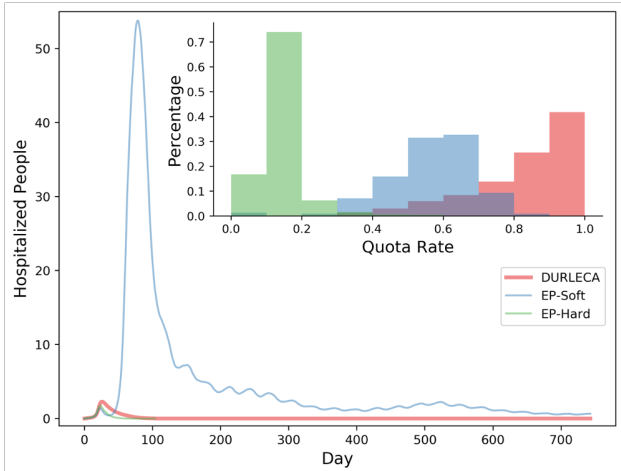

## Reinforced Epidemic Control: Saving both lives and economy

### Background: The Life-Economy-Privacy Trilemma in Epidemic Control

The epidemic has always been a threat to human society by exposing us in front of a dilemma between saving life or economy. The virus infects gathering people and spreads through daily commute movement. Controlling its infection must cut off daily mobility, which is a pillar of the modern economy. For instance, the recent outbreak of COVID-19 has caused millions of infections and hundreds of thousands of death tolls.  The epidemic forces many municipal governments to issue their stay-at-home order, which is a Fully LockDown (FLD) policy. FLD in most cities lasts for weeks thus deeply hurts the economy. 

    
    
Fully Lock Down Policy(FLD)

Some municipals try to only quarantine symptomatic people and their close contacts in the early period of virus spread. However, this infected-individual-quarantine policy would be only implementable when governments are able
to accurately and comprehensively tracing risky people. It is also unreliable when there exist many asymptomatic infected people. Current computer-science exploration pursues using smartphone data to infer and trace highly-risky people. However, fully tracing individual mobility and contacts requires full coverage of smartphones and further raises the concern of threatening privacy. According to an investigation by the University of Maryland and The Washington Post, around 60% of respondents either prefer not sharing their private information or do not own a smart phone[1].

    
    
Individual Quarantine Policy(FLD)

Some experts also suggested herd immunity as a possible solution. However, herd immunity requires no data and suffers no economic loss. However, this policy may lead to high infections and deaths.

The current policies have demonstrated a trilemma between privacy, economy and infections. As a possible solution, we hence introduce our **Reinforced Epidemic Control**, which attempts to control risky inter-regional mobility while not violating indivudual privacy and saves both life and economy.The goal is to lower the probability of risky movements with only relying on the regional statistics, the private data is dispensable.

    
    
Our proposal by controling risky inter-regional mobility 

### Challenges: To Generate the Reinforced Epidemic Control Policy

Generating a feasible solution for epidmic control is a high-dimensional sequential decision problem. The challegens distributes mainly in three folds:

1. Estimation Challenge. The vast and time-varing modern traffic makes it difficult to estimate the virus-speed risk hidden in mobility. Especially, it is hard to target the risky ones among all areas. 

    
    
J. Kim. GRAPH-BASED TRAJECTORY ANALYSIS[2]. The difficulty on measuring varing urban mobility.

2. Objective Challenge. It is not trivial to develop a practical and interpretable objective function for the dual-optimization problem. The objective function should be understandable for the government to easily adopted. Meanwhile, the function should also be able to be trained friendly.

3. Optimization Challenge. The exponential nature of epidemic outbreaks causes that epidemic control is vulnerable to estimation error. The training process is easy to be stuck in local optimums without a well-designed optimization methodoplgy. Avoiding the exponential-infecion-increasing is necessary to retain a well explorative result.

The challenges above cause the diffculty of fnding a smart and reliable epidemic-control policy. An implementable control policy cannot continuously quarantine the same urban region for too long. Furthermore, we also hope the policy-searching engine is still reliable even if the virus has diffused for weeks. 

As a result, we develop a **DUalobjective Reinforcement-Learning Epidemic Control Agent (DURLECA)** framework by combining Graph Neural Network and Reinforcement Learning approach, which is detailedly introduced as follows.

### Methodology: the DURLECA Framework

DUal-objective Reinforcement-Learning Epidemic Control Agent(DURLECA) is a GNN-enhanced RL agent to estimate regional infection risk and determine mobility quota. The overview of DURLECA is shown in the following figure.

    
    
An Overview of the DURLECA Framework.

We forumulate DURLECA designs in the following three aspects:

1. Flow-GNN. To well capture the graphic nature of the urban mobility network where regions are nodes connected
by OD flows, We develop a novel GNN architecture so that GNN can characterize the epidemic transmission process driven by regional infection aggregation upon inter-regional mobility. We refer our proposed GNN as Flow-GNN, which is developed on the basis of GraphSage[3].

2. Epidemic simulator based RL structure. The total simulation of the epidemic environment includes two parts: the mobility simulation and the epidemic simulation. The mobility simulation simulates the pre-discussed inter-regional quota distributing regulation. The epidemic simulation is built on our proposed SIHR model, adapted from the classical SIR model. The SIHR model distinguishes asymptomatic people. The agent has to make decisions with only visible patients. We use the actor-critic framework. Both are built on our proposed Flow-GNN, which is designed to characterize the epidemic transmission dynamic. Especially to solve the challenges mentioned above, we design a two-term reward function as follows.

- **Reward Function Design** We divide the reward function into an infection-spread-cost term and a Mobility-restriction-cost term. The infection-spread-cost term will boom once the hospitalized population exceeds the city’s healthcare capacity. The Mobility-restriction-cost term exponentially penalizes continuously restricting one area.

3. Exploration strategies. To improve the exploration efficiency, we first generate a pseudo-expert and let it guide exploration. Besides, we forbid the agent exploring some apparently unreasonable policies to help it get rid of local optimums.

### Experiments: the Effectiveness of DURLECA

We evaluate DURLECA on a real-world mobility dataset in Beijing. DURLECA gives a sophisticated policy shown in the following Quota-Distributing  Visualization.

    
    
Quota-Distributing Visualization.

Experiments show that DURLECA could maintain most of the mobility as well as keeping infections at a low level. Even with a late discovery, DURLECA retains 76% mobility while keeping the peak hospitalizations under 1.4 per thousand. Meanwhile, no region has to experience continuous restrictions.

    
    
The simulation visualization of DURLECA and selected baselines when the policy starts to interven on the 20th day. Main Figure: The number of hospitalized people along with time. Upper Right: The histogram for quota rates.

To compare DURLECA and other possible policies that a government might be using, we shown the simulation result in the comparison above. EP-Soft stands for an expert baseline that softly depends on historical mobility loss and current hospitalized to determine whether to lock down a region. Meanwhile, EP-Hard is another expert that can reopen a region if it has been locked down for successive days. Compared with the two baselines, DURLECA simultaneously suppresses the epidemic and retain large amounts of mobility. The mobility control policy searched by DURLECA achieved low values of Mean/Max H, which guarantee the demands for hospitalization will not exceed the capacity in many countries like China. The mobility control policy found by DURLECA also suppresses the total
infected population at a low level, about 1% of the total population. The red curve in Figure 3 presents the performance of DURLECA in epidemic suppression.

### Collabration: An invitation to DURLECA

To better test the generalibility and the stability of our proposed DURLECA framework, we hence welcome all researchers and policy makers who are interested in AI conducted epidemic control for collaborations. All are welcome to download the original DURLECA sources and simulate the control performance with individual urban settings and epidemic parameters. Don't forget to email your result to us and share it with others in the following dashboard!

| City       | Performance |
| --------    | -----:   |
| Beijing        |    |
|       |      |

### Resources and Contacts
[Paper Link: Reinforced Epidemic Control: Saving Both Lives and Economy]()

[KDD2020 VideoPresentation Link:]()

Contacts: siruisong97@gmail.com, zongzefang@hotmail.com

### References
[1] C Timberg, D Harwell, and A Safarpour. 2020. Most Americans are not willing or able to use an app tracking coronavirus infections. That’sa problem for Big Tech’s plan to slow the pandemic. Washington Post. Retrieved from [https://www.washingtonpost.com/technology/2020/04/29/most-americans-are-not-willing-orable-use-an-app-tracking-coronavirus-infections-thats-problem-big-techs-planslow-pandemic (2020)](https://www.washingtonpost.com/technology/2020/04/29/most-americans-are-not-willing-orable-use-an-app-tracking-coronavirus-infections-thats-problem-big-techs-planslow-pandemic (2020)).

[2]Figure: J. Kim. GRAPH-BASED TRAJECTORY ANALYSIS. Retrieved from [http://www.jiwonkim.co/graph-based-trajectory-analysis](http://www.jiwonkim.co/graph-based-trajectory-analysis/)

[3]Will Hamilton, Zhitao Ying, and Jure Leskovec. 2017. Inductive representation learning on large graphs. In Advances in neural information processing systems. 1024–1034.
